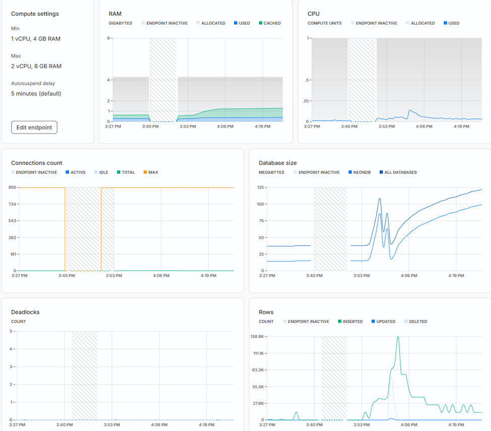

Rename the example.env to .env and update the connectionstring to run the application

# Performance results

Using the [Neon](https://neon.com) free tier (min 1 vCPU, 4 GB RAM and max 2 vCPU, 8 GB RAM)

Monitoring during the benchmarks shows that the CPU is not fully utilized, so there is room for improvement.



[Marten](https://martendb.io) 8.3 with NoSql design, see [code](https://github.com/mdissel/SqlNoSqlPerformance/blob/master/MartenDb/NoSql.cs).
```

BenchmarkDotNet v0.15.2, Windows 11 (10.0.26100.4484/24H2/2024Update/HudsonValley)
13th Gen Intel Core i7-1370P 1.90GHz, 1 CPU, 20 logical and 14 physical cores
.NET SDK 9.0.301
  [Host]     : .NET 8.0.17 (8.0.1725.26602), X64 RyuJIT AVX2
  DefaultJob : .NET 8.0.17 (8.0.1725.26602), X64 RyuJIT AVX2


```
| Method             | Mean        | Error     | StdDev     | Median      |
|------------------- |------------:|----------:|-----------:|------------:|
| Insert             | 1,569.36 ms | 67.691 ms | 185.302 ms | 1,606.75 ms |
| InsertBatch        | 1,490.85 ms | 27.707 ms |  61.971 ms | 1,474.53 ms |
| SelectWithIncludes |    19.17 ms |  0.495 ms |   1.459 ms |    18.43 ms |


Entity Framework 9.0.3 with relational design, see [code](https://github.com/mdissel/SqlNoSqlPerformance/blob/master/EF/EF.cs).

| Method             | Mean         | Error         | StdDev        | Median       |
|------------------- |-------------:|--------------:|--------------:|-------------:|
| Insert             | 42,408.45 ms | 11,858.474 ms | 34,778.853 ms | 34,926.92 ms |
| SelectWithIncludes |     14.32 ms |      0.286 ms |      0.769 ms |     13.88 ms |
